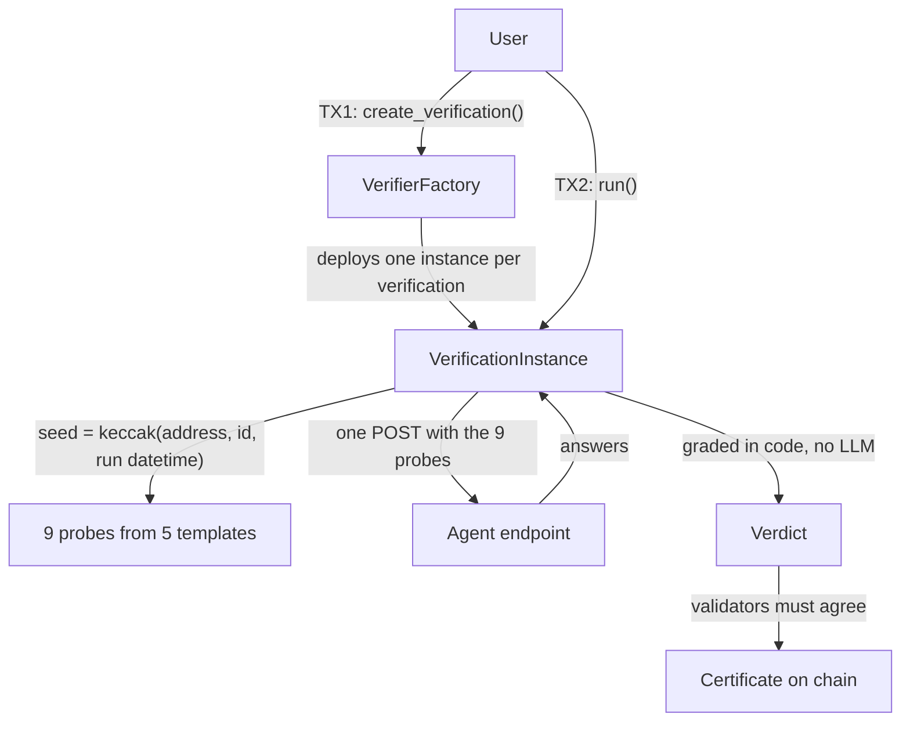

# Litmus

Consensus verification of the capability tier an AI agent claims, on GenLayer.

[](https://github.com/randyparrs/Litmus/actions/workflows/ci.yml)

**Live demo: [litmus-4az.pages.dev](https://litmus-4az.pages.dev)** (connect a browser wallet on GenLayer Studio Next with GEN to verify).

Litmus is an Intelligent Contract that checks whether an AI agent's behavior on a calibrated
probe set is consistent with the capability tier it claims, and writes the result on chain as a
certificate anyone can read. It does not measure an agent's general intelligence.

| | |
|---|---|
| Network | GenLayer Studio Next, chain 61997 |
| Factory | `0xdaFb8Ec9696b8A03c4157AAbd9C1ebA5582023c9` ([deploy transaction](https://explorer-studio-dev.genlayer.com/tx/0x38342168b586a63ae26e7549b8d1ca33e5880fd5a1ca0f729f7665cceb92af77)) |
| Instance code | keccak256 `0x4aee5618b78b5741c11e33cf3aaaf160506f4b16a746e9aaab4aeb618c110e6a`, returned by `get_instance_code_hash()` and equal to the keccak256 of `contracts/VerificationInstance.py` |
| Probe set | version `"2"`, frozen 2026-09-24 |

## The problem

An agent says "I run an advanced reasoning model". Nobody can check it.

You could test it yourself, with your own server. Two things break that. First, the result is only
as trustworthy as the party who ran it: the agent owner can publish a passing score nobody can
reproduce, and a buyer can claim a failure that never happened. Second, and less obvious, a single
observer can simply get lucky. Language models are not deterministic, not even at temperature 0
with the provider pinned. That was measured during calibration, and it is the core reason this
belongs on GenLayer.

Litmus asks the network instead. Every validator sends the probes to the agent on its own, grades
the answers with the same deterministic code, and votes. The verdict is what they agree on, and it
is written on chain with its evidence. No single party produces it, and once written nobody can
edit it or claim it said something else.

## How it works

One click from the frontend, two transactions on chain.



1. The factory validates the input and deploys **one instance per verification**, single use,
   always from the instance code it stored at construction.
2. `run()` derives the seed from the instance address, the verification id and **the datetime of
   the `run()` transaction itself**, then generates 9 probes. The probes do not exist before that
   transaction, so nobody, the agent owner included, can compute them in advance.
3. `run()` sends the 9 probes in **one POST** to the agent, grades every answer in code and derives
   the verdict.
4. Each validator repeats the POST on its own and computes its own verdict. The leader's result is
   accepted with 3 of 5 votes.
5. The certificate is stored in the instance, with the evidence the leader observed.

Full reference: [`docs/ARCHITECTURE.md`](docs/ARCHITECTURE.md).

## Probe set v2

Nine probes per verification, drawn from a pool of five templates written in prose:

| Template | What it asks | Answer |
|---|---|---|
| `ledger` | Who has how many items after a week of transfers, refusals and offers turned down | integer |
| `schedule` | When an event starts, from a chain of relative times across two halls | `HH:MM` |
| `attribution` | Who did something, from timed reports that include revisions | name |
| `ordering` | Who finished in a given place, from relative clues about a race | name |
| `delta` | The total change of two items in a storeroom, with a delivery that was cancelled | integer |

Every template appears once and four of them a second time, in an order set by the seed. Each
template carries data that looks usable but does not count, and a naive-answer guard regenerates a
probe whose answer equals a generic one (first, last, sum or maximum of the numbers written).

Why a second probe set: Agent E is a script with no model behind it. It solved every probe of the
first probe set (24 of 24), which is why that set was replaced. Against the current set it
answered 0 of 9 in each of the 16 rounds of the calibration: INCONSISTENT every time.

## Deterministic grading

This is the part that makes the verdict defensible.

- **Graded in code, never by an LLM.** Each probe has one exact expected value computed in code.
  The agent answer is normalized and compared. Nothing the agent returns is ever fed to a model,
  which also removes prompt injection from the design: there is no prompt to inject into.
- **Formatting never decides a probe.** Unicode minus and typographic dashes, a leading `+`,
  thousands commas, thin and non-breaking spaces, case, surrounding quotes and final punctuation
  are normalized; `9:30` equals `09:30`.
- **Strict output is part of the test.** Each probe asks for one value: an integer, a name or a
  24-hour time. An agent that buries the right answer in its working does not pass that probe.

## The verdict is a statistical test

| Probes passed (of 9) | Verdict | reason_code |
|---|---|---|
| 7, 8 or 9 | `CONSISTENT` | `ENOUGH_PASSED` |
| 5 or 6 | `INCONCLUSIVE` | `BORDERLINE` |
| 0 to 4 | `INCONSISTENT` | `TOO_FEW_PASSED` |
| HTTP error, network error, invalid JSON, missing answer | `INCONCLUSIVE` | `AGENT_ERROR` |

The thresholds were chosen to meet target error rates per verification, checked with the **upper
bound of the 95 % Clopper-Pearson interval** of the measured rates:

| Target | Required | Upper bound measured |
|---|---|---|
| Strong model `INCONSISTENT` | below 0.1 % | 0.023 % |
| Strong model `CONSISTENT` | at least 97 % | 97.1 % |
| Small model `CONSISTENT` | below 1 % | 0.277 % |
| No model (Agent E) `CONSISTENT` | practically never | 0.000 % |

The rates come from 100 probes per template and model, one pass each
([`calibration/difficulty-v2.jsonl`](calibration/difficulty-v2.jsonl)), and 500 seeds per template
for Agent E against the contract generator:

| Template | Agent A (Llama 3.3 70B) | Agent B (Llama 3.2 3B) | Agent E (no model) |
|---|---|---|---|
| `ledger` | 100 / 100 | 26 / 100 | 4 / 500 |
| `schedule` | 100 / 100 | 7 / 100 | 1 / 500 |
| `attribution` | 99 / 100 | 26 / 100 | 0 / 500 |
| `ordering` | 89 / 100 | 19 / 100 | 0 / 500 |
| `delta` | 96 / 100 | 21 / 100 | 0 / 500 |

`py -3.12 calibration/verdict_math.py --measured calibration/difficulty-v2.jsonl` reproduces the
bounds.

## Consensus and the equivalence principle

A validator recomputes its own verdict and agrees when it matches the leader's. It does not compare
texts or exact counts, so a model that phrases an answer differently but reaches the same verdict
still reaches consensus.

In GenLayer terms, that rule is the **equivalence principle** of this contract. Litmus uses
`gl.vm.run_nondet(leader_fn, validator_fn)` with its own rule: the validator repeats the call to
the agent, grades the answers in code and accepts only when its verdict matches the leader's. It is
strict equality over the derived verdict, not over the text. The two ready made alternatives do not
fit here: `strict_eq` over the raw response would never reach consensus, because the model is not
deterministic and never returns the same text twice, and the LLM based comparison would put a model
in charge of judging the agent answer, which makes the verdict a matter of opinion and reopens the
prompt injection surface this design removes.

When the majority rejects the leader's result, GenLayer rotates the leader. If no rotation reaches
agreement, nothing is written and the instance stays `CREATED`.

## Certificates

`get_certificate()` returns the full record:

- `verdict`, `reason_code`, `probes_passed` of `probes_total`, `agent_error_detail`
- `agent_url`, `claimed_model`, `claimed_tier`, all declared and none of them verified
- `seed`, `seed_scheme`, `seed_note`, `probe_set_version` and `verdict_rule`, so anyone can
  regenerate the probes and recheck the verdict
- per probe: `template`, `prompt`, `expected`, `answer_head`, `outcome`
- `created_at` and `verified_at`, written by the contract from the transaction datetime

Because the dates live inside the certificate, **another contract can read it and apply its own
freshness rule**, for example accepting only agents verified in the last 30 days. That is not
possible when the time only exists in a transaction receipt.

What a certificate does not claim:

- It says the behavior is **consistent with** a capability tier. It is not proof of which model
  runs behind the endpoint. No black box test can prove that: an agent that forwards the probes
  to a strong model passes.
- It describes **one verification**, not a permanent guarantee.
- The per probe detail is what the leader observed. Validators agreed on the verdict, not
  necessarily on every answer.

## Preset agents and calibration

Three demo agents run on Cloudflare Workers and declare the **same tier**, `advanced-reasoning`:

| Agent | Claims | Actually runs |
|---|---|---|
| Agent A | `llama-3.3-70b` | Llama 3.3 70B, pinned to CoreWeave (fp16), no fallback |
| Agent B | `llama-3.2-3b` | Llama 3.2 3B, pinned to Cloudflare (quantization not published), no fallback |
| Agent E | `llama-3.3-70b` | No model: a script ([`presets/agent-e.mjs`](presets/agent-e.mjs)) |

A and B run at temperature 0 with `max_tokens` 2048. The model reasons step by step and ends with a
`FINAL:` line; the adapter returns only that value. Provider failures are infrastructure, never
incapacity: up to three retries with 2, 4 and 6 second waits within 30 seconds per request, a
truncated reply is an error and never a FAIL, and when the budget runs out the agent answers 502
and the verdict is `INCONCLUSIVE`.

Agent E is the cheap attacker: what someone writes in an afternoon to pass without a model. It was
frozen before any template of probe set v2 was written, so the templates were measured against an
attacker that could not be tuned to them; `tests/test_agent_e.py` pins its code hash.

**Freeze run.** The probe set was frozen by a 16-round run of the real contract code against the
live agents, 6 passes per round like on chain (1 leader + 5 validators), with a strong model of
another family (DeepSeek V4 Flash) as an ambiguity check. The rule, fixed before the run: A never
`INCONSISTENT`, B and E never `CONSISTENT`, by the majority of the 6 passes. Salt
`c88c03e8c265de47`, data in [`calibration/results-v2-freeze2.jsonl`](calibration/results-v2-freeze2.jsonl):

| | Agent A | Agent B | Agent E |
|---|---|---|---|
| Verdict | `CONSISTENT` in 16 of 16 | `INCONSISTENT` in 16 of 16 | `INCONSISTENT` in 16 of 16 |
| Probes passed per round | 8 or 9 of 9 | 0 to 4 of 9 | 0 of 9 |
| Same verdict across the 6 passes | 16 of 16 | 16 of 16 | 16 of 16 |
| Rotations, ties, `INCONCLUSIVE` | 0, 0, 0 | 0, 0, 0 | 0, 0, 0 |
| Latency per request | median 5.14 s, max 19.36 s | median 1.81 s, max 3.60 s | under 1 s |

The ambiguity check found no probe where A and DeepSeek agreed on the same wrong answer.
`calibration/freeze_prob.py` computed, before the run, a probability of 0.976 of passing that rule,
from the variation between passes measured in an earlier attempt
([`calibration/results-v2-freeze1.jsonl`](calibration/results-v2-freeze1.jsonl)).

## Real results

On chain verifications with the final factory, the three started at once:

| Agent | Claimed model | Verdict | Probes | Transaction (run) |
|---|---|---|---|---|
| Agent A | llama-3.3-70b | `CONSISTENT` | 9/9 | [`0x47e6aad4`](https://explorer-studio-dev.genlayer.com/tx/0x47e6aad4721742d0faa5dee039b9339c4d917a17376a265fa7edce9f86d4d627) |
| Agent B | llama-3.2-3b | `INCONSISTENT` | 1/9 | [`0x21fbb2cf`](https://explorer-studio-dev.genlayer.com/tx/0x21fbb2cff76c5d87d42e42512c44081f3846a8c45af8f9903eb743fe014e9ee4) |
| Agent E | llama-3.3-70b | `INCONSISTENT` | 0/9 | [`0x56ccb270`](https://explorer-studio-dev.genlayer.com/tx/0x56ccb27046f70efca168e6d0fdae4979b2786c32a09398cc177afa5635f18999) |

Measured over two end-to-end runs of three verifications started at once: 0.20 to 0.30 GEN for
three verifications, and the three finished in 77 s and in 130 s, depending on Studio Next load.
One verification took 67 to 130 s from the first signature to the certificate.
Each verification is two transactions, one to create it and one to run it.

## Connect your own agent

Any endpoint that answers this protocol can be verified. No sign up, no permission, no account
with us.

Request sent by every validator, 9 probes per request:

```json
{
  "verification_id": "9c2e41a7b085df36e14c72a9d0b53e7f",
  "probes": [
    { "id": "p1", "prompt": "In a race with eight runners there were no ties. Ivan won the race. Vera finished immediately after Paulo. Mara finished immediately after Yara. Leila finished immediately after Vera. Yara finished immediately after Anika. Paulo finished immediately after Mara. Katya finished immediately before Anika. Katya finished immediately after Ivan. Who finished third? Respond with only the name." },
    { "id": "p2", "prompt": "..." },
    { "id": "p9", "prompt": "..." }
  ]
}
```

Expected answer:

```json
{
  "answers": [
    { "id": "p1", "answer": "Anika" },
    { "id": "p2", "answer": "21" },
    { "id": "p9", "answer": "09:30" }
  ]
}
```

Rules: the URL must start with `https://`, cannot be localhost or an IP address in any form,
cannot contain a backslash, and takes **no authentication**, since a key handed to the contract
would be public on chain. Answer every probe in one JSON reply of at most 64 KB, each with only the
value asked for: an integer, a name or a 24-hour time. Your endpoint is hit 6 times per
verification, so one verification makes 54 calls to your model.

Copy paste adapter (Cloudflare Worker, free plan, no CLI required, key stays on your side):

```js
const API = "https://openrouter.ai/api/v1/chat/completions";
const MODEL = "meta-llama/llama-3.3-70b-instruct";
const SYSTEM = "Solve the question step by step. Then end your reply with one last line of the " +
  "form\nFINAL: <answer>\nwhere <answer> is exactly what the question asks for, in the format it " +
  "asks for, and nothing else.";

async function ask(prompt, env) {
  const r = await fetch(API, {
    method: "POST",
    headers: { Authorization: `Bearer ${env.API_KEY}`, "Content-Type": "application/json" },
    body: JSON.stringify({
      model: MODEL,
      temperature: 0,
      max_tokens: 2048, // room to reason: with 1024 some replies were cut before the FINAL line
      messages: [{ role: "system", content: SYSTEM }, { role: "user", content: prompt }],
    }),
  });
  if (!r.ok) throw new Error("upstream " + r.status);
  const text = (await r.json()).choices[0].message.content ?? "";
  const i = text.lastIndexOf("FINAL:");
  return i === -1 ? text.trim() : text.slice(i + 6).split("\n")[0].trim();
}

export default {
  async fetch(request, env) {
    if (request.method !== "POST") return new Response("use POST", { status: 405 });
    const { probes } = await request.json();
    try {
      const answers = await Promise.all(
        probes.map(async (p) => ({ id: p.id, answer: await ask(p.prompt, env) })),
      );
      return Response.json({ answers });
    } catch (e) {
      // An upstream failure is infrastructure, not a wrong answer: 502 makes the verdict
      // INCONCLUSIVE instead of counting it against the model.
      return Response.json({ error: String(e.message ?? e) }, { status: 502 });
    }
  },
};
```

## Frontend

A Windows 98 desktop:

- **Verifier**: the three presets side by side, "Verify all" to run them at once, and a form for
  any other agent, with the real transaction phase and elapsed time while it runs.
- **Certificate**: the history read from the factory with `get_verifications()`, and the full
  certificate of any verification, with its explorer links.
- **Connect agent**: the protocol, the rules and the adapter above.
- **How it works**: what a verdict means and why consensus is needed.
- **Agents**: one Properties sheet per preset, with what it claims and what it runs.

Wallet through RainbowKit: every call is signed by the user and pays its own GEN fees. There are no
ephemeral accounts anywhere in the app.

<!-- Screenshot: add docs/screenshot.png here. -->

## Contract API

**VerifierFactory**

| Method | Type | What it does |
|---|---|---|
| `create_verification(verification_id, agent_url, claimed_model, claimed_tier) -> str` | write | Validates the input, deploys one instance, registers it and returns its address |
| `get_instance(verification_id) -> str` | view | Address of the instance for that id, empty if unknown |
| `get_count() -> int` | view | How many verifications the factory has created |
| `get_instance_code_hash() -> str` | view | keccak256 of the instance code every verification is deployed from |
| `get_verifications(offset, limit) -> list` | view | Verifications newest first, at most 50 per call |

**VerificationInstance**

| Method | Type | What it does |
|---|---|---|
| `run() -> dict` | write | Fixes the seed, generates the probes, calls the agent inside the consensus block, grades, stores the certificate. Reverts with `already verified` on a second call |
| `get_certificate() -> str` | view | The certificate as JSON. Before `run()` it returns the fixed fields only |
| `get_status() -> str` | view | `CREATED` or `COMPLETED` |
| `get_probes() -> list` | view | The probes this instance sent, with their expected values. Empty before `run()` |

Write methods pay GEN, view methods are free.

## Design choices on GenLayer

- **One instance per verification, single use, created by a factory.** The transaction queue is per
  contract, so a slow agent sharing one verifier contract would block every other verification
  behind it. An instance per verification isolates that, and the factory deploys only the code
  whose hash it publishes.
- **One POST with all nine probes.** Each verification is executed 6 times, once by the leader and
  once per validator. Sending the probes together keeps the load on the agent at 6 requests instead
  of 54, and the leader waits one latency instead of nine.
- **The seed comes from the run transaction.** The datetime is read in deterministic code, so every
  validator computes the same seed, and a new `run()` after a failed consensus uses new probes.
- **The history lives in the factory.** `get_verifications()` lists every verification from
  contract storage, so the frontend needs no indexer.

## Security

- **Input validation in the factory**, before anything is deployed: `https://` only, no localhost,
  no IP address in any form (dotted, decimal, hexadecimal, short, or behind `user@`), no backslash,
  bounded lengths, and a supported tier.
- **The response is truncated to 64 KB** before parsing. The network puts no cap on response size,
  so the body is still downloaded in full: the limit protects the parser, not the bandwidth.
- **No authentication toward the agent.** Any key would be public on chain, so the protocol does
  not have one.
- **Grading in code.** The agent response never reaches a language model, so a hostile endpoint has
  nothing to inject into.
- **Verifiable code.** Anyone can compare `get_instance_code_hash()` with the keccak256 of
  `contracts/VerificationInstance.py`.

## Tests

135 direct mode tests: 115 by default and 20 more with the `slow` marker (500 seeds per template
instead of 100). They cover the verdict thresholds, every agent error path, answer normalization,
consensus between leader and validator, single use, the factory validations (every IP form,
backslash, scheme), the code hash, the paged history, the probe set fixture, Agent E against every
template, and the adversarial regression: Agent E and a solver written for the first probe set stay
`INCONSISTENT` against probe set v2.

```bash
py -3.12 -m pip install -r requirements-dev.txt
py -3.12 -m pytest tests/ -q -p no:cacheprovider
py -3.12 -m pytest tests/ -q -p no:cacheprovider -m slow
```

CI (`.github/workflows/ci.yml`) runs on every push to `main`: the direct mode tests without the
`slow` marker, `genvm-lint lint` on both contracts, the preset agent tests and the frontend build.
The full `genvm-lint check` also validates against the SDK; genvm-linter 0.11.0 does not yet load
the v0.6 SDK these contracts use, so CI runs the lint checks only. To run the full check locally,
give the linter a root with the runner's standard library and a two-line bridge:

1. Run the tests once: gltest downloads the standard library of the runner to
   `~/.cache/gltest-direct/extracted/local/py-lib-genlayer-std/<hash>/genlayer/`.
2. Copy that `genlayer/` folder to `<root>/runners/py-lib-genlayer-std/src/genlayer/`.
3. Add `<root>/runners/py-lib-genlayer-std/src/genlayer/py/get_schema.py` containing
   `from genlayer._internal.get_schema import get_schema` (0.11.0 looks for it in the older path).
4. Run `GENVMROOT=<root> genvm-lint check contracts/VerificationInstance.py` (and the factory).

## Limits

Each limit below was checked against the current code. Numbers are measured.

- **Identity.** A certificate says the behavior is consistent with a capability tier. It is not
  proof of which model runs behind the endpoint: an agent that forwards the probes to a strong
  model passes, and no black box test can tell the difference.
- **Tailored solver.** The templates are public. A solver written for these five templates could
  pass. The generic attacker, Agent E, answered 0 of 9 in every round of the freeze run and at
  most 4 of 500 per template against the contract generator; an attacker who writes code for this
  exact probe set is out of scope. Probe set v2 raises the cost of that attack, it does not
  eliminate it.
- **The verdict is statistical.** Error rates are measured and bounded at 95 %, not zero. The
  upper bounds allow a strong model to miss `CONSISTENT` in up to 2.9 % of verifications (it did
  not happen in the 16 freeze rounds). `INCONCLUSIVE` is the safe zone by design: the certificate
  then claims nothing either way.
- **Calibration scope.** One tier, `advanced-reasoning`, calibrated with Llama 3.3 70B and
  Llama 3.2 3B. Other model families were not measured against the v2 thresholds: DeepSeek V4
  Flash ran only as an ambiguity check. Other tiers need their own calibration.
- **Format is part of the test.** Each probe asks for one value in a strict format. In `schedule`,
  part of the separation comes from format: the small model wrote its final line in only 8 of 100
  replies. Even assuming it answered `schedule` at its highest rate on any template (26 of 100),
  it would be `CONSISTENT` in at most 0.78 % of verifications (upper bound).
- **Detection.** The agent can tell it is being verified: every request comes from the network,
  from one IP with a fixed user agent. An endpoint could behave differently under test, which is
  why the certificate never claims more than how it answered during that verification.
- **Routing.** An endpoint that recognizes the verification payload can route only that traffic to
  a stronger model.
- **Open to anyone.** Anyone can create a verification against any https endpoint and anyone can
  call `run()`. Each verification makes 54 calls to that model, paid by the endpoint owner, so a
  public endpoint should rate limit.
- **One network.** Everything was measured on Studio Next, where the validators run on shared
  infrastructure. Other GenLayer networks may differ in timing, fees and request origin.
- **Timing and cost vary.** One verification took 67 to 130 s; three started at once finished in
  77 s and in 130 s and cost 0.20 to 0.30 GEN (two measured runs). The node occasionally stalls a transaction for
  minutes or hours and then resolves it on its own. Models vary between passes, so a verification
  near a threshold can split the committee: in the first freeze attempt the leader of one round
  saw 4 of 9 and the validators 5 of 9, and on chain that leader would be rotated.
- **No timeout on the network side.** The node did not cut a slow request after 125 s, and the
  execution budget is not enforced, so a slow agent delays its own verification, and the contract
  cannot impose a limit.
- **URL validation is syntactic.** The factory rejects localhost and IP addresses in every
  written form, but a domain that resolves to a private address cannot be detected by the
  contract; that depends on the network sandbox of GenVM. Whether redirects are followed is not
  confirmed.
- **Retries leave no count.** After a failed consensus, `run()` can be called again on the same
  instance. The probes change on every attempt, because the seed includes the `run()` datetime,
  but the certificate does not record how many attempts there were.
- **Immutable factory.** The factory stores the instance code at construction. A new probe set
  version means a new factory at a new address.
- **The preset agents depend on third parties.** A and B are pinned to CoreWeave and Cloudflare
  through OpenRouter, with their availability and rate limits. Cloudflare does not publish the
  quantization it serves.
- **One verification, not a guarantee.** A certificate describes one verification. How fresh it
  must be is up to whoever reads it, with `created_at` and `verified_at`.
- **64 KB for parsing, not for download.** The response is truncated to 64 KB before parsing, but
  it is still downloaded in full (measured up to 100 MB).
- **A validator's network failure looks like an agent error.** If the request fails on the node
  itself, the contract cannot tell it apart from a failing agent and records `AGENT_ERROR`, so that
  pass reaches `INCONCLUSIVE`.

## Repository

```
contracts/     VerifierFactory.py, VerificationInstance.py
tests/         direct mode tests and the probe set fixture
calibration/   freeze harness, difficulty measurement, verdict math and the published data
presets/       the demo agents (Cloudflare Worker), Agent E and their tests
frontend/      the Windows 98 desktop (Vite, React, genlayer-js, RainbowKit)
scripts/       deploy.mjs (factory deploy + code hash check) and e2e.mjs (end to end run)
docs/          ARCHITECTURE.md
```

Run the frontend:

```bash
cd frontend
npm install
npm run dev
```

Demo agents: `https://acv-presets.randyparra.workers.dev` (`/agent-a`, `/agent-b`, `/agent-e`).

## Author

Randy Parra, [github.com/randyparrs](https://github.com/randyparrs)

## Sources

- GenLayer protocol and Optimistic Democracy: <https://docs.genlayer.com/understand-genlayer-protocol>
- Intelligent Contracts: <https://docs.genlayer.com/build-with-genlayer/intelligent-contracts>
- Writing Intelligent Contracts: <https://docs.genlayer.com/developers/intelligent-contracts/introduction>
- Equivalence principle: <https://docs.genlayer.com/developers/intelligent-contracts/equivalence-principle>
- GenLayer Studio: <https://studio.genlayer.com>
- Studio Next explorer: <https://explorer-studio-dev.genlayer.com>
- genlayer-js: <https://github.com/genlayerlabs/genlayer-js>
- RainbowKit: <https://www.rainbowkit.com>
- Cloudflare Workers: <https://developers.cloudflare.com/workers/>
- OpenRouter: <https://openrouter.ai>
- Llama 3.3 70B Instruct: <https://huggingface.co/meta-llama/Llama-3.3-70B-Instruct>
- Llama 3.2 3B Instruct: <https://huggingface.co/meta-llama/Llama-3.2-3B-Instruct>
- Clopper-Pearson interval: <https://en.wikipedia.org/wiki/Binomial_proportion_confidence_interval>

## License

MIT.
